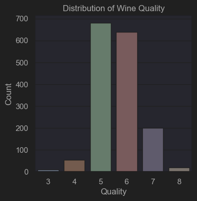
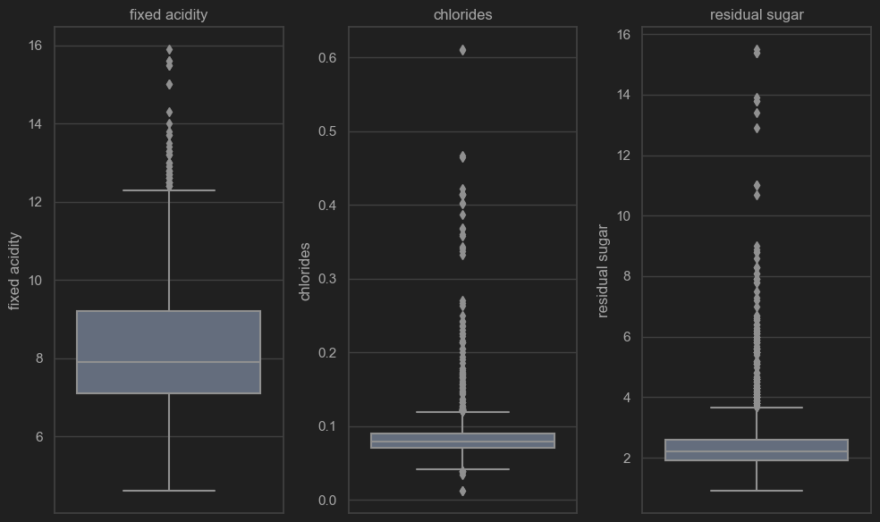
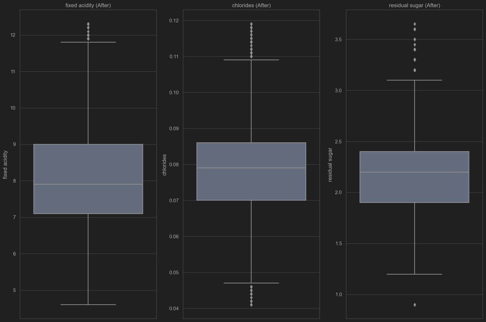

# WineQualityPrediction

### 數據加載和初步探索
使用pandas加載葡萄酒資料集，然後通過.info()查看數據概況，確認數據類型和是否存在缺失值。
通過.isnull().sum()檢查缺失值，確認數據集中沒有缺失值。
使用Seaborn的countplot繪制葡萄酒質量的分布情況，了解不同質量等級的樣本分布。

---

### 數據預處理
移除目標變量quality，以便對其他特徵進行處理。
使用四分位距（IQR）方法識別並處理異常值，通過計算每個特徵的Q1、Q3和IQR，然後用中位數替換異常值。
繪制特徵箱形圖，分析異常值處理前後的變化。

### 特征分析和選擇
計算並可視化特徵之間的相關系數矩陣，以識別存在高相關性的特徵組合。
應用主成分分析（PCA）降維，通過累計解釋方差圖選擇保留的主成分數量。

### 數據不平衡處理
使用SMOTE和ADASYN技術處理訓練數據的類別不平衡問題。

### 模型訓練和評估
訓練多個模型（隨機森林、邏輯回歸、支持向量機（SVM）、人工神經網絡（ANN）），並使用網格搜索優化模型參數。
使用ROC曲線和其他評估指標（如精確度、召回率、F1分數和Matthews相關系數（MCC））比較模型性能。

### ROC曲線繪制
定義一個函數plot_multi_model_roc，將所有模型的ROC曲線繪制在同一張圖上，以便直觀比較不同模型的性能。該函數還計算並顯示了Gini系數和MCC作為性能指標。
通過這個流程，可以全面了解數據，對數據進行有效的預處理，應用多種機器學習技術，並最終選出表現最佳的模型。每一步都是數據科學項目中常見的步驟，旨在從原始數據中提取有價值的信息，構建預測模型，並評估模型的性能。

